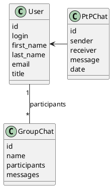

# Компонентная архитектура
<!-- Состав и взаимосвязи компонентов системы между собой и внешними системами с указанием протоколов, ключевые технологии, используемые для реализации компонентов.
Диаграмма контейнеров C4 и текстовое описание. 
-->

## Компонентная диаграмма

```plantuml
@startuml
!include https://raw.githubusercontent.com/plantuml-stdlib/C4-PlantUML/master/C4_Container.puml

AddElementTag("microService", $shape=EightSidedShape(), $bgColor="CornflowerBlue", $fontColor="white", $legendText="microservice")
AddElementTag("storage", $shape=RoundedBoxShape(), $bgColor="lightSkyBlue", $fontColor="white")

Person(admin, "Администратор")
Person(moderator, "Модератор")
Person(user, "Пользователь")

System_Ext(web_site, "Клиентский веб-сайт", "HTML, CSS, JavaScript, React", "Веб-интерфейс")

System_Boundary(messenger_app, "Мессенджер Приложение") {
   Container(user_service, "Сервис пользователей", "C++", "Сервис управления пользователями", $tags = "microService")    
   Container(group_chat_service, "Сервис групповых чатов", "C++", "Сервис управления групповыми чатами", $tags = "microService") 
   Container(ptp_chat_service, "Сервис PtP чатов", "C++", "Сервис управления приватными чатами", $tags = "microService")   
   ContainerDb(db, "База данных", "MariaDB", "Хранение данных о пользователях, чатах и сообщениях", $tags = "storage")
   
}

Rel(admin, web_site, "Управление пользователями и чатами")
Rel(moderator, web_site, "Модерация контента и пользователей")
Rel(user, web_site, "Общение через мессенджер")

Rel(web_site, user_service, "Работа с пользователями", "localhost/users")
Rel(user_service, db, "INSERT/SELECT/UPDATE", "SQL")

Rel(web_site, group_chat_service, "Работа с групповыми чатами", "localhost/groupchats")
Rel(group_chat_service, db, "INSERT/SELECT/UPDATE", "SQL")

Rel(web_site, ptp_chat_service, "Работа с PtP чатами", "localhost/ptp")
Rel(ptp_chat_service, db, "INSERT/SELECT/UPDATE", "SQL")

@enduml

```
## Список компонентов  

### Сервис пользователей
**API**:
- Создание нового пользователя
      - входные параметры: login, пароль, имя, фамилия, email, обращение (г-н/г-жа)
      - выходные параметры: отсутствуют
- Поиск пользователя по логину
     - входные параметры:  login
     - выходные параметры: имя, фамилия, email, обращение (г-н/г-жа)
- Поиск пользователя по маске имени и фамилии
     - входные параметры: маска фамилии, маска имени
     - выходные параметры: login, имя, фамилия, email, обращение (г-н/г-жа)

### Сервис групповых чатов
**API**:
- Создание группового чата
  - Входные параметры: название чата, участники
  - Выходные параметры: идентификатор чата
- Добавление пользователя в чат
  - Входные параметры: идентификатор чата, участник
  - Выходные параметры: отсутствуют
- Добавление сообщения в групповой чат
  - Входные параметры: идентификатор чата, автор, сообщение, дата
  - Выходные параметры: идентификатор сообщения
- Загрузка сообщений группового чата
  - Входные параметры: идентификатор чата
  - Выходные параметры: массив сообщений

### Сервис PtP чатов
**API**:
- Отправка PtP сообщения пользователю
  - Входные параметры: отправитель, получатель, сообщение, дата
  - Выходные параметры: идентификатор сообщения
- Получение PtP списка сообщений для пользователя
  - Входные параметры: идентификатор пользователя
  - Выходные параметры: массив сообщений

### Модель данных

